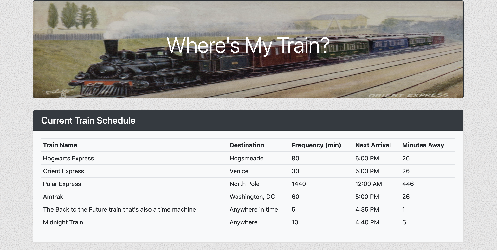
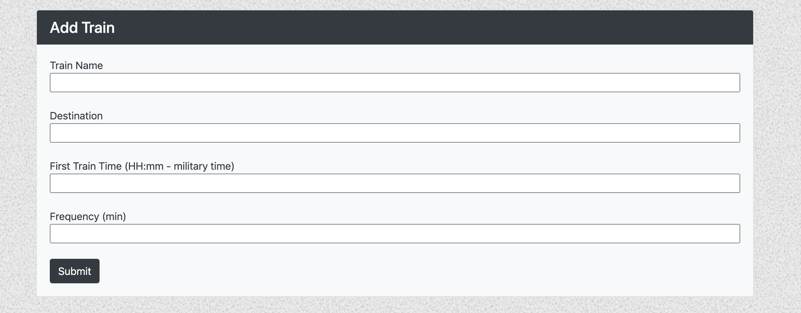

# Train-Scheduler

**[Application](https://hebahm.github.io/Train-Scheduler/)**

This app creates a table with mulitple trains' information, based on the user's input.

The information is stored on and retrieved from Firebase, so previously entered data will be on the browser upon refresh, and new data will be added to the end of the table.

Also, given the first train time and frequency, the app will calculate the amount of time until the next train based on the current time.

